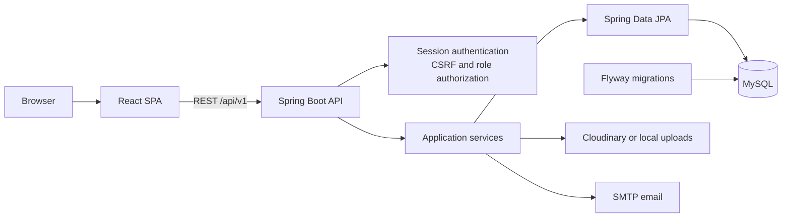

# PHOME

PHOME is a full-stack rental property platform that connects tenants with landlords and provides administrators with tools to moderate listings and manage the community.

The application is built as a React single-page application backed by a Spring Boot REST API. It includes role-based workflows, property discovery, viewing appointments, reviews, notifications, content reporting, database migrations, automated tests, and containerized deployment.

## Key Features

### Tenant

- Search, filter, sort, and browse approved rental listings
- View property details, images, landlord information, and reviews
- Save and remove favorite properties
- Request, reschedule, and cancel viewing appointments
- Review properties after an approved viewing
- Comment on listings and report inappropriate content
- Manage profile information, avatar, and password
- Receive and manage in-app notifications

### Landlord

- View a dashboard with room and appointment statistics
- Create, edit, and remove property listings
- Upload multiple property images
- Track approved, pending, and rejected listings
- Review, approve, or reject viewing requests
- Receive moderation feedback from administrators

### Administrator

- View platform, user, listing, and report statistics
- Approve or reject property listings with feedback
- Enable or disable user accounts
- Review reported rooms and reviews
- Hide listings or remove reviews that violate platform rules

## Technology Stack

| Layer | Technologies |
| --- | --- |
| Frontend | React 19, Vite 6, React Router, TanStack Query, Axios, Lucide React |
| Backend | Java 21, Spring Boot 3.4, Spring MVC, Spring Security, Spring Data JPA, Bean Validation |
| Database | MySQL 8.4, Flyway |
| Storage and email | Cloudinary with local file fallback, Spring Mail |
| Testing | JUnit, Mockito, Spring Security Test, H2 |
| Delivery | Docker, Docker Compose, GitHub Actions, Spring Boot Actuator |

## Architecture



React is the only user interface. During development, Vite runs on port `5173` and proxies API requests to Spring Boot on port `8080`. For a production build, Spring Boot serves the compiled React application and REST API from the same origin on port `8080`.

Authentication uses a server-side session cookie and CSRF protection. Endpoint authorization is enforced for the `Tenant`, `Landlord`, and `Admin` roles.

## Repository Structure

```text
PHOME/
├── .github/workflows/ci.yml        # Continuous integration
├── README.md
└── Study/
    ├── frontend/                   # React application
    ├── src/main/java/.../
    │   ├── Config/                 # Security, CORS, storage configuration
    │   ├── Controller/Api/         # REST controllers
    │   ├── Service/                # Business logic
    │   ├── Respository/            # Spring Data repositories
    │   └── entity/                 # JPA entities
    ├── src/main/resources/
    │   ├── db/migration/           # Flyway migrations and demo data
    │   └── application*.yaml       # Environment profiles
    ├── src/test/                   # Backend tests
    ├── Dockerfile
    └── compose.yaml
```

## Getting Started

### Prerequisites

For local development:

- Java 21
- Node.js 22 and npm
- MySQL 8

For containerized deployment:

- Docker with Docker Compose

### Option 1: Run with Docker Compose

Clone the repository and enter the application directory:

```bash
git clone https://github.com/letuanphat2004/PHOME.git
cd PHOME/Study
```

Create an environment file:

```bash
cp .env.example .env
```

On Windows PowerShell:

```powershell
Copy-Item .env.example .env
```

Set a secure value for `MYSQL_ROOT_PASSWORD` in `.env`, then start the stack:

```bash
docker compose up --build -d
docker compose ps
```

Open [http://localhost:8080](http://localhost:8080).

Docker Compose starts MySQL, waits for it to become healthy, applies all Flyway migrations, and then starts PHOME with the `prod` profile. Database files and locally uploaded images are stored in the `phome_mysql_data` and `phome_uploads` volumes.

To stop the application:

```bash
docker compose down
```

### Option 2: Run Locally with MySQL

Create the MySQL database or allow the configured JDBC URL to create it automatically. Set the database credentials before starting the backend.

Linux or macOS:

```bash
cd Study
export DB_USERNAME=root
export DB_PASSWORD=your-password
./mvnw spring-boot:run
```

Windows PowerShell:

```powershell
cd Study
$env:DB_USERNAME = "root"
$env:DB_PASSWORD = "your-password"
.\mvnw.cmd spring-boot:run
```

In a second terminal, start the frontend:

```bash
cd Study/frontend
npm ci
npm run dev
```

Open [http://localhost:5173](http://localhost:5173).

### Option 3: Run with the In-Memory Demo Profile

The `demo` profile uses H2 and does not require MySQL:

```bash
cd Study
./mvnw spring-boot:run -Dspring-boot.run.profiles=demo
```

Run the React development server in a second terminal as shown above.

## Demo Accounts

Flyway creates the following MySQL demo accounts. They share the password `Demo1234`.

| Role | Username |
| --- | --- |
| Tenant | `tenant_demo` |
| Landlord | `landlord_demo` |
| Administrator | `admin_demo` |

The sample catalog contains 35 landlord-owned rooms with approved, pending, and rejected states, allowing all moderation and management workflows to be tested.

The H2 `demo` profile uses the shorter usernames `tenant`, `landlord`, and `admin`, also with the password `Demo1234`.

## Environment Variables

Copy `Study/.env.example` as a starting point. Never commit real credentials.

| Variable | Required | Default or purpose |
| --- | --- | --- |
| `DB_URL` | Production | `jdbc:mysql://localhost:3306/Study?createDatabaseIfNotExist=true` locally |
| `DB_USERNAME` | Production | `root` locally |
| `DB_PASSWORD` | Yes | MySQL password |
| `MYSQL_ROOT_PASSWORD` | Docker Compose | Password used by the MySQL container and application |
| `APP_PORT` | No | Host port for Docker Compose; defaults to `8080` |
| `SESSION_COOKIE_SECURE` | Production HTTPS | Set to `true` behind HTTPS |
| `FRONTEND_ORIGIN` | Separate frontend | Allowed CORS origin; defaults to `http://localhost:5173` |
| `MAIL_USERNAME` | Password reset email | SMTP account |
| `MAIL_PASSWORD` | Password reset email | SMTP application password |
| `CLOUDINARY_CLOUD_NAME` | No | Enables Cloudinary image storage when configured |
| `CLOUDINARY_API_KEY` | No | Cloudinary API key |
| `CLOUDINARY_API_SECRET` | No | Cloudinary API secret |

If Cloudinary is not configured, uploaded files are stored under `Study/uploads`. SMTP credentials are required for the password-reset email flow.

## API Overview

All application endpoints use the `/api/v1` prefix.

| Area | Base path | Access |
| --- | --- | --- |
| Authentication and password reset | `/auth` | Public and authenticated |
| Public room search and details | `/rooms` | Public |
| Profile and password management | `/profile` | Authenticated |
| Favorites | `/favorites` | Tenant |
| Viewing appointments | `/appointments` | Tenant and landlord |
| Room reviews | `/rooms/{roomId}/reviews` | Public read, tenant write |
| Notifications | `/notifications` | Authenticated |
| Content reports | `/reports` | Authenticated |
| Landlord dashboard and rooms | `/landlord` | Landlord |
| Moderation and user management | `/admin` | Administrator |

Mutation requests require the CSRF token returned by `GET /api/v1/auth/csrf`. The React API client handles token acquisition, refresh, and session-expiration synchronization automatically.

## Database Migrations

Flyway owns the MySQL schema. Migrations are stored in:

```text
Study/src/main/resources/db/migration
```

Hibernate runs with `ddl-auto: validate`, so schema changes must be introduced with a new versioned migration:

```text
V10__describe_the_change.sql
```

Do not modify a migration that has already been applied to a shared database.

## Build and Test

Run backend tests:

```bash
cd Study
./mvnw test
```

On Windows:

```powershell
cd Study
.\mvnw.cmd test
```

Validate and build the frontend:

```bash
cd Study/frontend
npm ci
npm run lint
npm run build
```

Backend tests use an in-memory H2 database and do not require a running MySQL instance.

GitHub Actions runs frontend linting, the production frontend build, and backend tests for every push and pull request.

## Production Build

To serve the frontend and backend from a single Spring Boot process:

```bash
cd Study/frontend
npm ci
npm run build
cd ..
./mvnw clean package
java -jar target/Study-0.0.1-SNAPSHOT.jar
```

The application is available at [http://localhost:8080](http://localhost:8080).

The health endpoint is:

```text
GET /actuator/health
```

For an HTTPS deployment, run the application behind a reverse proxy, provide all database secrets through the deployment environment, and set `SESSION_COOKIE_SECURE=true`.

## Roadmap

- Event-driven notifications with Apache Kafka
- Real-time notification delivery with WebSocket
- Dedicated notification and analytics services
- Broader integration and end-to-end test coverage
